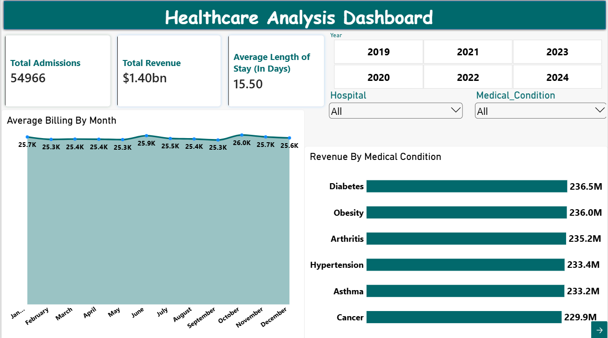
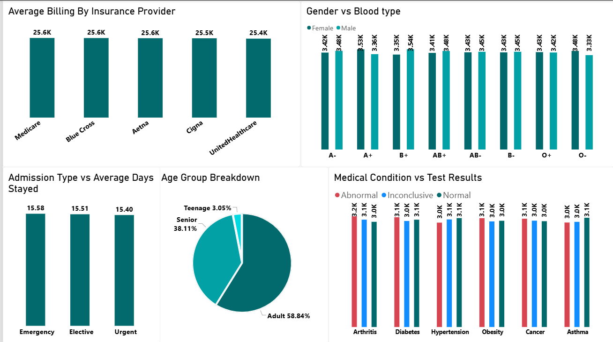

# End-to-End Healthcare Analytics: Python, SQL & Power BI

**Excel & Power Query | Python (Pandas, Seaborn) | MySQL | Power BI | 54,966 admissions**

An end-to-end analytics project that cleans, models and visualizes 54,966 hospital admission records ($1.40B in billing) to show hospital management where revenue comes from, how long patients stay, when demand peaks and who the patients are.

---

## 📌 Executive Summary

- **$1.40B in total billing** across 54,966 admissions, about **$25.5K per admission**.
- **Average stay is 15.5 days** and barely changes by admission type (15.40-15.58 days) or medical condition.
- **Revenue and demand are evenly spread.** No single condition, insurer or month dominates. Diabetes leads revenue at $236.5M (16.8%), only just above the 16.7% an even split across the six conditions would give.
- **Patient mix:** Adults (20-59) 58.84%, Seniors (60+) 38.11%, Teenagers (13-19) 3.05%.
- **Admissions peak in July-August**, only about 4% above the monthly average.

---

## 🎯 Business Problem

Hospital management needs answers to four questions before planning staffing, capacity and billing reviews:

1. Where does billing revenue come from (conditions, insurers, hospitals)?
2. How long do patients stay, and does it vary by condition or admission type?
3. Is there a seasonal peak in admissions?
4. What does the patient population look like (age, gender, blood type, test results)?

---

## 📊 Dataset

- **Source:** [Kaggle - Healthcare Dataset](https://www.kaggle.com/datasets/prasad22/healthcare-dataset)
- **Nature:** The dataset is entirely synthetic (generated patient names, hospitals and doctors). The project demonstrates the analytics workflow, not findings about a real hospital.
- **Size:** 54,966 rows, 15 raw columns, 19 after feature engineering
- **Period:** Admissions from 8 May 2019 to 7 May 2024 (5 years)
- **Patient ages:** 13 to 89 (no admissions under 13)
- **Raw columns:** Name, Age, Gender, Blood_Type, Medical_Condition, Date_of_Admission, Doctor, Hospital, Insurance_Provider, Billing_Amount, Room_Number, Admission_Type, Discharge_Date, Medication, Test_Results
- **Engineered columns:** Days_Stayed, Age_Group, Year, Month
- **Records vs patients:** The data has no patient ID, so each row is treated as one admission.
- **Currency:** The source does not state a currency. Amounts are shown in $ because the insurers are U.S. providers (Medicare, Aetna, Cigna, Blue Cross, UnitedHealthcare).

---

## 🛠️ Tools & Pipeline

| Stage | Tool | What was done |
|---|---|---|
| 1. Assessment | Excel & Power Query | Initial data assessment, data type corrections, whitespace trimming |
| 2. Cleaning & features | Python (Pandas, Seaborn) | Validated 0 null values and 0 duplicates; converted admission and discharge fields to dates; trimmed text columns; corrected 106 negative billing amounts (0.19% of records, raw minimum -2,008) using absolute values, assuming sign-entry errors rather than refunds (worst-case impact on total billing: about 0.03%); engineered `Days_Stayed`, `Age_Group`, `Year` and `Month`; explored distributions with Seaborn |
| 3. Analysis | MySQL | Loaded the cleaned table and wrote 12 business queries using `GROUP BY`, `ORDER BY`, aggregates and `ROUND()` |
| 4. Dashboard | Power BI Desktop | Built a 2-page interactive report with Year, Hospital and Medical Condition slicers |

**Feature engineering**
- `Days_Stayed` = Discharge_Date - Date_of_Admission (range 1-30 days)
- `Age_Group`: Teenage (13-19), Adult (20-59), Senior (60+)

**Business questions answered in SQL**
- Total admissions and total billing
- Top revenue condition and most prescribed medication
- Revenue by insurance provider
- Average length of stay overall and by condition
- Emergency admissions by age group
- Average billing by test result
- Top 3 hospitals by revenue
- Condition and gender mix
- Longest stays
- Average billing and stay by condition
- Admissions by month

---

## 📈 Dashboard Pages

### Page 1 - Executive & Revenue Overview
- KPI cards: Total Admissions, Total Revenue, Average Length of Stay
- Slicers: Year, Hospital, Medical Condition
- Average billing trend by month
- Revenue by medical condition

### Page 2 - Clinical Metrics & Demographics
- Average billing by insurance provider
- Gender vs blood type
- Admission type vs average days stayed
- Age group breakdown
- Medical condition vs test results

---

## 💡 Key Insights

1. **Scale.** 54,966 admissions generated $1.40B in billing, about $25.5K per admission, with individual bills reaching $52.8K.
2. **Revenue is spread almost evenly across conditions.** Diabetes is the top earner at $236.5M (16.9% of billing). With six conditions, an even split would be 16.7%.
3. **Length of stay is uniform.** Average stay is 15.5 days (median 15, range 1-30). Emergency admissions average 15.58 days, Elective 15.51 and Urgent 15.40. Asthma has the longest stay at 15.68 days, only 0.18 above the overall average.
4. **Seasonal demand is mild.** August (4,785 admissions) and July (4,765) lead, against a monthly average of about 4,580 (+4.5% and +4.0%). Both are 31-day months, so the real seasonal lift is smaller still.
5. **Billing is stable.** Average billing per admission stays between $25.26K (September) and $26.02K (October) across months, and sits at roughly $25K-$26K for each of the five insurers.
6. **Older patients are a large share.** Adults (20-59) account for 58.84% of admissions (32,341), Seniors (60+) 38.11% (20,948) and Teenagers (13-19) 3.05% (1,677).
7. **Test outcomes are balanced.** Abnormal, Inconclusive and Normal results each fall at roughly 3.0K-3.2K admissions for every one of the six conditions, so no condition stands out for abnormal results.

---

## ✅ Recommendations

1. **Target the long-stay tail.** Stays are spread evenly across 1-30 days, and 25% of admissions run longer than 23 days. Review discharge planning for these admissions first to free bed capacity.
2. **Keep staffing flat with a summer buffer.** July-August admissions run only about 4% above average, so a modest buffer is more appropriate than large seasonal hiring.
3. **Plan for an older population.** Seniors make up 38% of admissions. Prioritize geriatric care capacity and post-discharge support.
4. **Audit billing consistency.** Average bills are nearly identical across conditions, insurers and admission types. A pricing review should confirm that billing reflects treatment complexity.

---

## 📁 Repository Structure

| Path | Contents |
|---|---|
| `/Dataset/` | Cleaned healthcare dataset (.xlsx) |
| `/Python/` | Cleaning and feature engineering notebook (.ipynb) |
| `/SQL_Queries/` | Business queries (.sql) |
| `/PowerBI/` | Interactive dashboard file (.pbix) |
| `/images/` | Dashboard screenshots |
| `README.md` | Project documentation |

---

## 🙋 Work With Me

I build **Power BI dashboards, Excel reporting and data cleaning pipelines** that turn raw data into decisions. Open to freelance projects and full-time roles.

- Dashboard design and DAX modeling (Power BI)
- Excel analysis, pivot reporting and automation
- Data cleaning and analysis with Python and SQL

**Contact:** `<your-email>` | `<Upwork / Fiverr profile link>` | [LinkedIn](https://www.linkedin.com/in/nasrath-banu-a-016b952b4)
